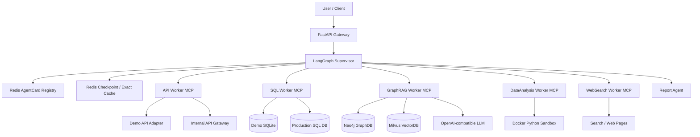

# Enterprise Knowledge Brain

企业级知识图谱决策大脑。项目基于 GraphRAG、LangGraph、MCP、FastAPI、Neo4j、Milvus、Redis 和 OpenAI 兼容大模型接口构建，面向企业内部知识问答、结构化报表查询、内部业务接口调用、联网情报检索、数据分析绘图和长报告生成等场景。

## 目录

- [项目简介](#项目简介)
- [核心功能](#核心功能)
- [系统特点](#系统特点)
- [技术栈](#技术栈)
- [架构概览](#架构概览)
- [快速开始](#快速开始)
- [数据建库](#数据建库)
- [API 接口](#api-接口)
- [MCP Worker](#mcp-worker)
- [项目结构](#项目结构)
- [配置说明](#配置说明)
- [测试与评估](#测试与评估)
- [生产部署建议](#生产部署建议)
- [许可证](#许可证)

## 项目简介

Enterprise Knowledge Brain 将企业内部的非结构化文档、图谱关系、结构化数据库、内部系统接口和外部互联网情报统一纳入一个多 Agent 调度体系中。用户只需要提出自然语言问题，Supervisor 会根据问题类型动态发现可用 Worker，并通过 MCP 工具调用完成数据检索、分析和最终回答合成。

系统支持两类运行模式：

- `demo`：使用本地模拟 SQL 数据和内部 API，适合本地开发、演示和单元测试。
- `production`：连接真实业务数据库与内部 API 网关，适合企业环境集成。

## 核心功能

### 1. GraphRAG 知识库问答

- 支持 PDF 离线建库：PDF 解析、滑动窗口切块、实体关系抽取、Neo4j 图谱写入、Milvus 向量写入。
- 查询链路包含查询重写、实体识别、检索路由、向量检索、图谱检索、混合检索和回答合成。
- 支持 Neo4j N-hop 图谱邻域展开，适合实体关系、投资关系、合作链路、上下游依赖等问题。
- 支持 Milvus 向量检索，适合语义主题、政策条款、文档段落和上下文追溯。

### 2. 多 Agent 调度

- 使用 LangGraph 构建 Supervisor 工作流。
- 使用 Redis 保存 LangGraph checkpoint、AgentCard 注册信息和查询缓存。
- 通过 MCP Streamable HTTP 挂载独立 Worker，Supervisor 可动态发现并调用工具。
- 支持并行调度多个 Worker，例如同时查询财务报表、内部审批状态和企业知识库。

### 3. 结构化数据查询

- SQL Worker 提供只读 SQL 查询能力。
- `demo` 模式内置 SQLite 演示表 `financial_reports`。
- `production` 模式通过 `BUSINESS_SQL_DATABASE_URL` 连接真实只读业务数据源。
- SQL 执行器限制非 `SELECT` 语句，拦截 `DROP`、`INSERT`、`UPDATE`、`DELETE` 等危险操作。

### 4. 内部业务 API 集成

- API Worker 提供项目审批、部门预算、员工工单等内部接口能力。
- `demo` 模式使用本地函数模拟业务系统响应。
- `production` 模式转发到 `INTERNAL_API_BASE_URL` 指定的真实服务。

### 5. 联网情报检索

- WebSearch Worker 支持多步联网检索。
- 使用 DuckDuckGo 搜索候选结果。
- 使用 Playwright 抓取动态网页正文。
- 使用 LLM 对网页内容进行压缩摘要，并生成来源可追溯的情报报告。

### 6. 数据分析与可视化

- DataAnalysis Worker 可根据上下文数据和用户指令生成 Python 分析代码。
- 使用本地 OpenAI 兼容代码模型接口，默认配置为 `Qwen/Qwen2.5-Coder-32B-Instruct`。
- 在 Docker 隔离沙盒中执行 Python 代码，限制网络、内存和 CPU。
- 支持输出 stdout、stderr 和 base64 内嵌图表。

### 7. 长报告生成

- Report Agent 支持异步长报告生成。
- 使用 LangGraph 构建大纲规划、人工确认、分章节起草、全文组装流程。
- 支持人工审核大纲后继续执行。
- 支持 Markdown 和 PDF 下载。

### 8. 可观测性与评估

- 支持 LangSmith tracing。
- 支持 RAGAS 自动化评估，输出 `evaluation/audit_report.csv`。
- 提供 Faithfulness 和 Answer Relevance 等指标，用于检验 RAG 回答质量。

## 系统特点

- **GraphRAG 双引擎检索**：Neo4j 负责实体关系和图谱拓扑，Milvus 负责语义相似度检索，两者可按问题类型独立或混合使用。
- **MCP 解耦架构**：每个 Worker 独立暴露 MCP 工具，主应用只维护连接池和调度逻辑，便于横向扩展。
- **动态服务发现**：Worker 启动后向 Redis 注册 AgentCard，Supervisor 根据在线 Worker 动态生成路由候选。
- **并行任务派发**：复杂问题可同时分发给多个 Worker，降低串行调用耗时。
- **安全边界明确**：SQL 只读限制、Python Docker 沙盒、生产环境 CORS 校验和真实适配器强校验。
- **配置集中管理**：通过 Pydantic Settings 统一读取 `.env`，避免密钥散落在代码中。
- **本地 Embedding 推理**：默认使用 `BAAI/bge-m3`，减少文档向量化阶段的数据外泄风险。
- **可测试性强**：核心 Agent、GraphRAG、Indexer、SQL/API 工具均支持依赖注入和 mock 测试。
- **支持演示与生产切换**：`APP_PROFILE=demo` 适合快速验证，`APP_PROFILE=production` 强制配置真实数据源和内部 API。

## 技术栈

| 类别 | 技术 |
| --- | --- |
| Web 框架 | FastAPI, Starlette, Uvicorn |
| Agent 编排 | LangGraph, LangChain Core |
| 工具协议 | MCP Streamable HTTP |
| 大模型接口 | OpenAI SDK, DeepSeek OpenAI-compatible API |
| 图数据库 | Neo4j |
| 向量数据库 | Milvus Standalone |
| Embedding | sentence-transformers, BAAI/bge-m3 |
| 缓存与注册中心 | Redis |
| PDF 解析 | pdfplumber |
| 联网检索 | duckduckgo-search, Playwright, BeautifulSoup |
| 数据分析沙盒 | Docker SDK, pandas, matplotlib, seaborn |
| 评估 | RAGAS, LangSmith, datasets |
| 测试 | pytest, pytest-asyncio |

## 架构概览



## 快速开始

### 环境要求

- Python 3.10+
- Docker 和 Docker Compose
- DeepSeek API Key 或其他 OpenAI 兼容模型服务
- 可选：本地 vLLM 代码模型服务，用于 DataAnalysis Worker

### 1. 克隆并安装依赖

```bash
git clone <your-repo-url>
cd enterprise-knowledge-brain

python -m venv .venv
source .venv/bin/activate  # Windows: .venv\Scripts\activate

pip install -r requirements.txt
```

如需以可编辑包方式安装：

```bash
pip install -e ".[dev]"
```

联网检索功能需要安装浏览器运行时：

```bash
playwright install chromium
```

### 2. 配置环境变量

```bash
cp .env.example .env
```

至少需要设置：

```env
APP_PROFILE=demo
DEEPSEEK_API_KEY=your_api_key
NEO4J_PASSWORD=your_neo4j_password
```

首次加载 `BAAI/bge-m3` 会下载模型文件。如 HuggingFace 访问受限，可设置：

```env
HF_ENDPOINT=https://hf-mirror.com
```

### 3. 使用 Docker Compose 启动完整系统

```bash
docker compose up -d
docker compose ps
```

默认服务端口：

| 服务 | 地址 |
| --- | --- |
| FastAPI Gateway | http://localhost:8000 |
| Swagger UI | http://localhost:8000/docs |
| API Worker MCP | http://localhost:8001/mcp |
| SQL Worker MCP | http://localhost:8002/mcp |
| GraphRAG Worker MCP | http://localhost:8003/mcp |
| DataAnalysis Worker MCP | http://localhost:8004/mcp |
| WebSearch Worker MCP | http://localhost:8005/mcp |
| Neo4j Browser | http://localhost:7474 |
| Milvus SDK | localhost:19530 |
| Redis | localhost:6379 |
| MinIO Console | http://localhost:9001 |

### 4. 本地开发方式启动

如果只希望在本机运行 Python 服务，可先启动基础设施：

```bash
docker compose up -d neo4j redis etcd minio milvus-standalone
```

然后分别启动 MCP Worker：

```bash
python -m mcp_servers.api_server
python -m mcp_servers.sql_server
python -m mcp_servers.graphrag_server
python -m mcp_servers.data_analysis_server
python -m mcp_servers.web_search_server
```

最后启动主应用：

```bash
uvicorn main:app --reload --host 0.0.0.0 --port 8000
```

## 数据建库

通过 CLI 执行 PDF 建库：

```bash
python -m graphrag.indexer --pdf ./data/annual_report.pdf
```

只解析并打印抽取结果，不写入 Neo4j 和 Milvus：

```bash
python -m graphrag.indexer --pdf ./data/annual_report.pdf --dry-run
```

也可以通过 HTTP 触发后台建库：

```bash
curl -X POST http://localhost:8000/index \
  -H "Content-Type: application/json" \
  -d '{"pdf_path":"./data/annual_report.pdf","dry_run":false}'
```

## API 接口

### 健康检查

```http
GET /health
```

返回 Neo4j 和 Milvus 的连接状态。

### 企业问答

```http
POST /query
Content-Type: application/json

{
  "question": "请查询招商银行极速开户系统的投入情况，并说明审批状态"
}
```

返回字段包括：

- `question`：原始问题
- `normalized`：标准化查询，GraphRAG 链路会返回该字段
- `entities`：识别出的实体
- `route`：检索或调度策略
- `answer`：最终回答
- `vector_hits`：向量检索命中数
- `graph_stats`：图谱检索统计
- `elapsed_ms`：请求耗时
- `error`：错误信息

### 图谱实体查询

```http
GET /graph/entities?entity_type=公司&limit=50
```

### 图谱关系查询

```http
GET /graph/relations?relation_type=投资&entity_name=招商&limit=50
```

### 长报告生成

创建报告任务：

```http
POST /report/generate
Content-Type: application/json

{
  "topic": "企业智能风控平台建设分析报告",
  "requirements": "包含预算、技术路线、风险和实施建议"
}
```

查询状态：

```http
GET /report/{task_id}/status
```

审批大纲：

```http
POST /report/{task_id}/outline/approve
Content-Type: application/json

{
  "approved_outline": [
    {
      "title": "项目背景",
      "purpose": "说明建设背景、业务痛点和目标"
    }
  ]
}
```

下载报告：

```http
GET /report/{task_id}/download?format=pdf
GET /report/{task_id}/download?format=markdown
```

### A2A 服务发现

```http
GET /agents
```

返回当前 Redis 注册中心中仍然在线的 AgentCard 列表。

## MCP Worker

| Worker | 端口 | 工具 | 功能 |
| --- | --- | --- | --- |
| API_Worker | 8001 | `get_approval_status`, `get_department_budget`, `get_employee_tickets` | 内部项目审批、预算、工单查询 |
| SQL_Worker | 8002 | `execute_financial_sql` | 只读财务报表查询 |
| GraphRAG_Worker | 8003 | `ask_enterprise_knowledge_base` | 企业知识库图谱和向量检索 |
| DataAnalysis_Worker | 8004 | `run_analysis_and_plot` | Python 数据分析和图表生成 |
| WebSearch_Worker | 8005 | `conduct_web_research` | 联网搜索、网页抓取和情报报告 |

Worker 启动后会向 Redis 写入 `agentcard:{agent_id}`，并通过心跳续期。主应用启动时建立 MCP 长连接池，并将工具列表交给 Supervisor 做函数调用路由。

## 项目结构

```text
enterprise-knowledge-brain/
├── agents/                 # LangGraph Agent 与多 Agent 调度逻辑
│   ├── planner_agent.py    # Supervisor，动态发现 Worker 并调度 MCP 工具
│   ├── graphrag_agent.py   # GraphRAG 查询链路
│   ├── report_agent.py     # 异步长报告生成
│   ├── web_researcher_agent.py
│   ├── sql_agent.py
│   ├── api_agent.py
│   └── prompts.py
├── api/
│   └── routes.py           # FastAPI 路由和请求响应模型
├── core/
│   ├── config.py           # Pydantic Settings 配置
│   ├── logger.py           # Rich 日志
│   └── registry.py         # Redis AgentCard 注册中心
├── evaluation/
│   └── evaluator.py        # RAGAS 评估流水线
├── graphrag/
│   ├── indexer.py          # PDF 建库流水线
│   ├── graph_search.py     # Neo4j 图谱检索
│   ├── prompts.py
│   └── skills.py
├── mcp_servers/            # MCP Streamable HTTP Worker 服务
├── memory/                 # 记忆模块占位
├── scripts/
│   └── run_eval.py         # 自动化评估入口
├── tests/                  # pytest 单元测试
├── tools/                  # SQL、API、Python 沙盒和 Web 工具
├── utils/                  # Redis、语义缓存、事件发布、PDF 导出
├── docker-compose.yml      # 应用、MCP Worker 与基础设施编排
├── Dockerfile
├── main.py                 # FastAPI 应用入口
├── pyproject.toml
├── requirements.txt
└── .env.example
```

## 配置说明

关键环境变量如下：

| 变量 | 默认值 | 说明 |
| --- | --- | --- |
| `APP_PROFILE` | `demo` | 运行模式，支持 `demo` 和 `production` |
| `DEEPSEEK_API_KEY` | 无 | OpenAI 兼容大模型 API Key |
| `DEEPSEEK_BASE_URL` | `https://api.deepseek.com/v1` | OpenAI 兼容接口地址 |
| `DEEPSEEK_MODEL` | `deepseek-chat` | 大模型名称 |
| `NEO4J_URI` | `bolt://localhost:7687` | Neo4j Bolt 地址 |
| `NEO4J_USER` | `neo4j` | Neo4j 用户名 |
| `NEO4J_PASSWORD` | 无 | Neo4j 密码 |
| `MILVUS_HOST` | `localhost` | Milvus 主机 |
| `MILVUS_PORT` | `19530` | Milvus 端口 |
| `MILVUS_COLLECTION` | `enterprise_docs` | Milvus collection |
| `EMBEDDING_MODEL` | `BAAI/bge-m3` | 本地 Embedding 模型 |
| `REDIS_URL` | `redis://localhost:6379/0` | Redis 地址 |
| `BUSINESS_SQL_DATABASE_URL` | 空 | 生产模式真实业务数据库地址 |
| `INTERNAL_API_BASE_URL` | 空 | 生产模式内部 API 网关地址 |
| `VLLM_BASE_URL` | `http://localhost:8000/v1` | 本地代码模型 OpenAI 兼容地址 |
| `VLLM_MODEL_NAME` | `Qwen/Qwen2.5-Coder-32B-Instruct` | 数据分析代码生成模型 |
| `LANGCHAIN_TRACING_V2` | `false` | 是否启用 LangSmith tracing |
| `LANGCHAIN_API_KEY` | 空 | LangSmith API Key |

生产模式会强制校验：

- `CORS_ALLOW_ORIGINS` 不能包含 `*`
- 必须配置 `BUSINESS_SQL_DATABASE_URL`
- 必须配置 `INTERNAL_API_BASE_URL`

## 测试与评估

运行单元测试：

```bash
pytest
```

运行指定测试：

```bash
pytest tests/test_graphrag_agent.py -v
pytest tests/test_indexer.py -v
pytest tests/test_sql_api_agents.py -v
```

联网测试默认跳过。如需运行 Web Researcher 测试：

```bash
RUN_WEB_TESTS=1 pytest tests/test_web_agent.py -v
```

运行 RAGAS 自动评估：

```bash
python scripts/run_eval.py
```

评估结果会追加写入：

```text
evaluation/audit_report.csv
```

## 生产部署建议

- 使用 `APP_PROFILE=production`，接入真实只读数据库和内部 API 网关。
- 为业务数据库账号配置最小权限，只授予必要的只读查询权限。
- 将 `DEEPSEEK_API_KEY`、`NEO4J_PASSWORD`、数据库连接串等敏感配置交给密钥管理系统注入。
- 为 MCP Worker、FastAPI Gateway、Neo4j、Milvus 和 Redis 配置独立监控与日志采集。
- 为 `/query` 增加企业级认证鉴权，目前代码通过 `X-OIDC-User` 读取网关透传用户。
- 对 DataAnalysis Worker 的 Docker 沙盒镜像、执行超时、资源限制和输出目录进行安全审计。
- 在生产评估中扩展 GraphRAG 返回原始检索上下文，再启用严格的 RAGAS faithfulness 审计。

## 许可证

当前仓库未声明开源许可证。请在发布或商用前补充 `LICENSE` 文件，并明确代码、模型、数据和文档的使用边界。
